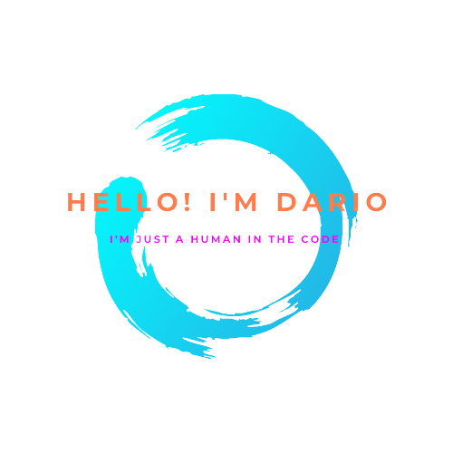

 

### :man_technologist: &nbsp;About Me : 

#### I'm an ecuadorian 🇪🇨 Tech Lover and Software Developer 👨🏻‍💻, focus in Mobile📲 and Frontend Development 🎨

- ✈️ I move in the world with the subject of help people with my skills and moves to others person make it. 
- 💭 I believe that technology is a tool with the power to improve the society and create opportunities for all
- 📌 I live in Ecuador a beautiful country that have a lot of landscapes [(Quito-Ecuador)](https://www.google.com/maps/place/Ciudad+Mitad+del+Mundo/@-0.1817487,-77.9992061,8z)!
- :octocat: I love read about philosophy and all branches that born of it. I play videogames and I keep learning. 
- 😻 I'm Interested in the Tech world like: Virtual assistants, Blockchain, Web3, UX/UI, Robotic and others.

---

### 🛠 &nbsp;Languages and Tools :

&nbsp;
&nbsp;
&nbsp;
&nbsp;
&nbsp;
&nbsp;
&nbsp;
&nbsp;
&nbsp;

---

### 🔥 &nbsp; My Stats :

